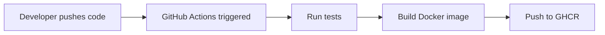

# Docker Image Deployment Flow

This document explains how Docker image changes are automatically deployed to your Raspberry Pi when you push commits.

## Current Setup Overview

### What Happens Now

1. **You push code** → GitHub receives the commit
2. **CI builds image** → GitHub Actions builds the Docker image (but doesn't push it)
3. **Raspberry Pi** → Currently builds images locally from source code

### What We Need for Auto-Deployment

For automatic deployment, we need:

1. **CI pushes images** → Build and push to GitHub Container Registry (GHCR) on each commit
2. **docker-compose.yml** → Configured to pull from registry instead of building locally
3. **Systemd service** → Automatically pulls and restarts on boot/periodically

## Complete Deployment Flow

### Step 1: Code Push Triggers CI



**What happens:**

- Push to `main` branch triggers `.github/workflows/main.yml`
- Tests run (linting, Python tests, etc.)
- Docker image is built for ARM64 (Raspberry Pi 5)
- Image is pushed to `ghcr.io/and3rn3t/minecraft-server:latest`

### Step 2: Image Available in Registry

The image is now available at:

```
ghcr.io/and3rn3t/minecraft-server:latest
ghcr.io/and3rn3t/minecraft-server:main
ghcr.io/and3rn3t/minecraft-server:<commit-sha>
```

### Step 3: Raspberry Pi Pulls Image

**Option A: Automatic Pull on Boot (Current Setup)**

The systemd service pulls the image when the Pi boots:

```ini
[Service]
ExecStartPre=/bin/sh -c 'cd /home/pi/minecraft-server && /usr/bin/docker compose pull || true'
ExecStart=/bin/sh -c 'cd /home/pi/minecraft-server && /usr/bin/docker compose up -d'
```

**Option B: Periodic Pull (Recommended for Auto-Updates)**

A systemd timer can periodically check for updates:

```ini
# /etc/systemd/system/minecraft-update.timer
[Unit]
Description=Check for Minecraft Server Updates
Requires=minecraft.service

[Timer]
OnBootSec=5min
OnUnitActiveSec=1h
RandomizedDelaySec=5min

[Install]
WantedBy=timers.target
```

```ini
# /etc/systemd/system/minecraft-update.service
[Unit]
Description=Pull Latest Minecraft Server Image
After=network-online.target

[Service]
Type=oneshot
WorkingDirectory=/home/pi/minecraft-server
ExecStart=/bin/sh -c 'docker compose pull && docker compose up -d --force-recreate'
User=pi
```

## Configuration Changes Needed

### 1. Update CI Workflow to Push Images

Currently, the CI workflow builds but doesn't push. We need to:

**In `.github/workflows/main.yml`:**

- Add GitHub Container Registry login
- Change `push: false` to `push: true` for main branch
- Push images with appropriate tags

### 2. Update docker-compose.yml

Change from building locally to pulling from registry:

**Current (builds locally):**

```yaml
services:
  minecraft:
    build:
      context: .
      dockerfile: Dockerfile
```

**Updated (pulls from registry):**

```yaml
services:
  minecraft:
    image: ghcr.io/and3rn3t/minecraft-server:latest
    pull_policy: always # Always pull latest
```

### 3. Configure Registry Authentication

The Raspberry Pi needs to authenticate to pull from GHCR:

```bash
# On Raspberry Pi
echo $GITHUB_TOKEN | docker login ghcr.io -u and3rn3t --password-stdin
```

Or use a Personal Access Token with `read:packages` permission.

## Complete Workflow Diagram

```
┌─────────────────────────────────────────────────────────────┐
│ 1. Developer Workflow                                        │
└─────────────────────────────────────────────────────────────┘
         │
         │ git push origin main
         ▼
┌─────────────────────────────────────────────────────────────┐
│ 2. GitHub Actions CI/CD                                      │
│    - Run tests                                               │
│    - Build Docker image (ARM64)                              │
│    - Push to GHCR:                                           │
│      ghcr.io/and3rn3t/minecraft-server:latest      │
└─────────────────────────────────────────────────────────────┘
         │
         │ Image available in registry
         ▼
┌─────────────────────────────────────────────────────────────┐
│ 3. Raspberry Pi (Automatic)                                  │
│    Option A: On Boot                                         │
│    - Systemd service starts                                  │
│    - docker compose pull (gets latest image)                 │
│    - docker compose up -d (starts container)                │
│                                                              │
│    Option B: Periodic Check                                  │
│    - Systemd timer runs every hour                           │
│    - Pulls latest image                                      │
│    - Restarts container if image changed                     │
└─────────────────────────────────────────────────────────────┘
```

## Implementation Steps

### Step 1: Enable Image Pushing in CI

Update `.github/workflows/main.yml` to push images on main branch commits.

### Step 2: Update docker-compose.yml

Change from `build:` to `image:` pointing to the registry.

### Step 3: Set Up Registry Authentication

Configure the Raspberry Pi to authenticate with GHCR.

### Step 4: Configure Auto-Pull

Set up systemd service/timer to automatically pull and restart.

## Benefits

✅ **Automatic Updates** - Pi gets latest code without manual intervention  
✅ **Consistent Images** - Same image tested in CI runs on Pi  
✅ **Fast Deployment** - No need to build on Pi (saves time/resources)  
✅ **Rollback Capability** - Can pull specific versions/tags  
✅ **Multi-Device** - Same image works across multiple Pis

## Security Considerations

1. **Use Personal Access Tokens** - Not your GitHub password
2. **Limit Token Permissions** - Only `read:packages` needed
3. **Store Securely** - Use Docker credential helper or systemd secrets
4. **Private Registry** - GHCR supports private images

## Troubleshooting

### Image Not Found

```bash
# Check if image exists in registry
docker pull ghcr.io/and3rn3t/minecraft-server:latest

# Verify authentication
docker login ghcr.io
```

### Pull Fails with 403

- Check token permissions
- Verify token hasn't expired
- Ensure repository is public or token has access

### Container Doesn't Update

```bash
# Force pull and recreate
docker compose pull
docker compose up -d --force-recreate

# Check current image
docker images | grep minecraft-server
```

## Next Steps

See the implementation guide for step-by-step setup instructions.
